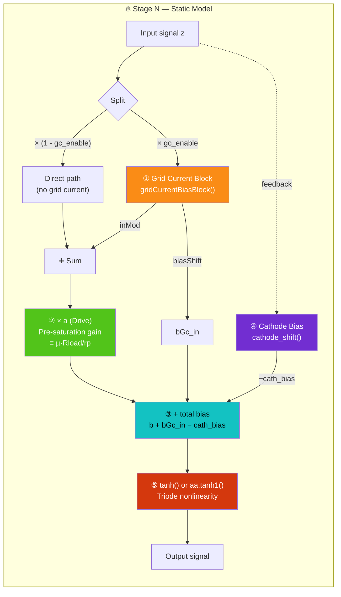
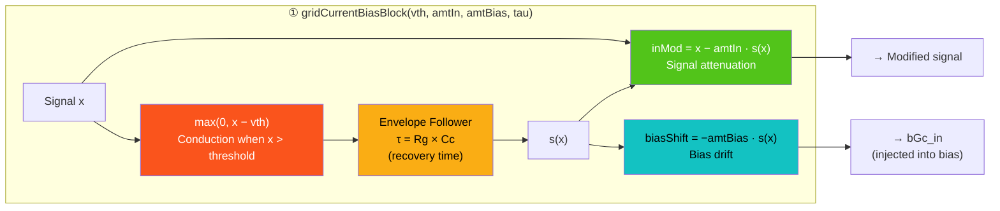
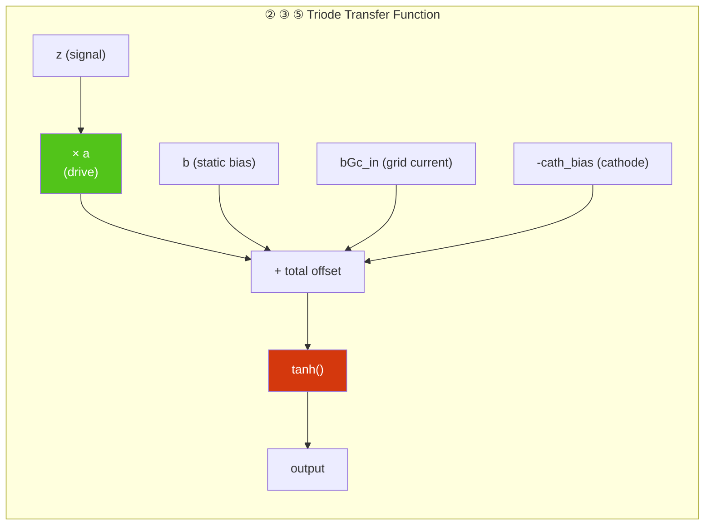
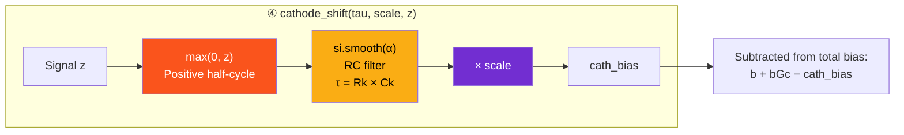
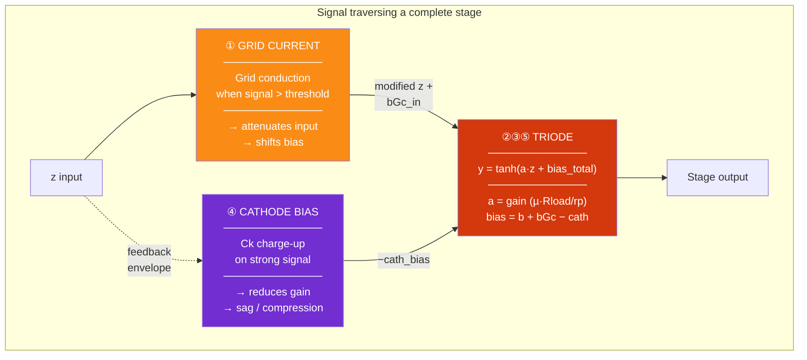
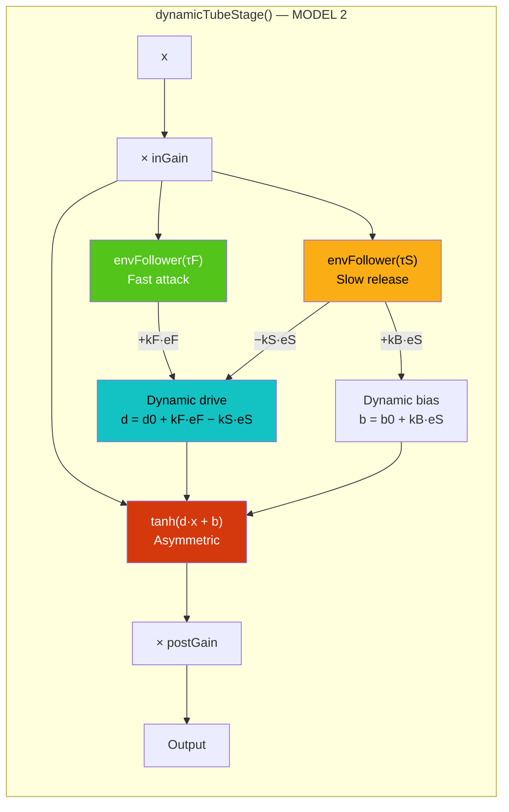
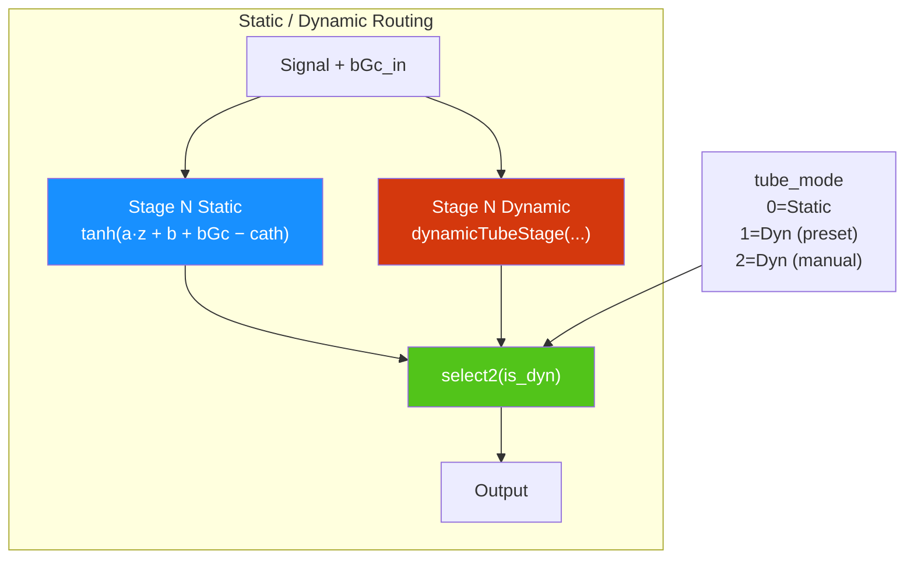

# Preamp Architecture — Grid Current + Triode Nonlinearity + Cathode Bias

> Source: [IFCpreampGridCurrentCathodeBiasOptionnalDynStage.dsp](file:///Users/michelbuffa/Documents/Recherche/WAMs/NAM_NEURAL_AMP_MODELER/AMP_FAUST/AmpFullFaust/AmpFaust_repoGithub/dsp/IFCpreampGridCurrentCathodeBiasOptionnalDynStage.dsp)

---

## 1. Overview — Preamp Topology

The preamp is a cascade of **1 to 3 triode stages** (selectable by preset), with interstage filtering and monitoring.

```mermaid
flowchart LR
    IN["🎸 Input"] --> IV["× input_vol"]
    IV --> M1["📊 Meter 1"]
    M1 --> S1["🔥 Stage 1"]
    S1 --> M2["📊 Meter 2"]
    M2 --> DC1["DC Block"]
    DC1 --> GK["× gk<br/>(interstage gain)"]
    GK --> F12["Filter 12<br/>HPF + LPF"]
    F12 --> S2["🔥 Stage 2"]
    S2 --> M3["📊 Meter 3"]
    M3 --> DC2["DC Block"]
    DC2 --> F23["Filter 23<br/>HPF + LPF"]
    F23 --> S3["🔥 Stage 3"]
    S3 --> M4["📊 Meter 4"]
    M4 --> DC3["DC Block"]
    DC3 --> MV["× master_vol<br/>× level_comp<br/>× gk_comp"]
    MV --> EQ["Post EQ<br/>Hi/Lo Cut"]
    EQ --> OUT["🔊 Output"]

    style S1 fill:#d4380d,color:#fff
    style S2 fill:#d4380d,color:#fff
    style S3 fill:#d4380d,color:#fff
    style F12 fill:#1d39c4,color:#fff
    style F23 fill:#1d39c4,color:#fff
    style EQ fill:#7c3aed,color:#fff
```



> [!NOTE]
> Stages 2 and 3 are optional. In "1 stage" mode, only S1 is active. The number of stages is driven by the preset (`amp_preset`).

---

## 2. Anatomy of a Static Stage (MODEL 1)

Each stage combines **three physical sub-models** in series. Here is the detail for one stage (e.g. Stage 1):



### Mathematical formula for the stage:

```
output = tanh( a · z_mod + b + bGc_in − cath_bias )
```

Where:
| Symbol | Meaning | Physical correspondence |
|--------|---------|------------------------|
| `z` | Input signal | Grid voltage Vg |
| `a` | Drive (pre-saturation gain) | µ · R_load / r_p (triode voltage gain) |
| `b` | Static bias | Quiescent Vgk (operating point) |
| `bGc_in` | Grid current bias | Bias shift due to grid conduction (blocking) |
| `cath_bias` | Cathode bias shift | Charge of bypass capacitor Ck (dynamic sag) |
| `tanh()` | Nonlinearity | Triode transfer curve Ia(Vgk) |

---

## 3. Detail: ① Grid Current (Grid Conduction)

Models the **grid conduction** phenomenon when Vgk > 0.



### Physics of the phenomenon:

```
When the signal is strong (Vg > 0):
  → The grid conducts current through Rg
  → The coupling capacitor Cc charges up
  → Vgk drifts negative (slow recovery, τ = Rg × Cc)

Audible result:
  → "Strangling" / "blocking distortion" on loud transients
  → Signal compresses and bias shifts temporarily
```

### Parameters and their sonic effect:

| Parameter | Role | Low value | High value |
|-----------|------|-----------|------------|
| **vth** (threshold) | Conduction threshold | 0.2 → triggered often (hi-gain) | 0.8 → rarely triggered (clean) |
| **amtIn** | Input attenuation | 0 → no effect | 1 → heavy compression |
| **amtBias** | Bias shift amount | 0 → no drift | 1 → strong strangling |
| **tau** (ms) | Recovery time constant | 5ms → tight attack | 500ms → slow "breathing" |

---

## 4. Detail: ② ③ Triode Nonlinearity (Drive + Bias → tanh)

This is the heart of the triode distortion.



### Effect of bias `b` on waveform shape:

```
b = 0    → symmetric tanh   → ODD harmonics (H3, H5)  → "transistor" sound
b < 0    → asymmetric tanh  → EVEN harmonics (H2, H4) → "tube/warm" sound
|b| large → strong asymmetry → dominant H2              → very "tubey" sound
```

### Effect of drive `a`:

```
a small (1-3)  → signal stays in the linear region of tanh → clean tone
a medium (4-6) → progressive saturation                    → crunch
a large (8-10) → permanent saturation                      → hi-gain, compressed
```

---

## 5. Detail: ④ Cathode Bias Shift (Dynamic Sag)

Models the charge of the cathode bypass capacitor Ck.



### Physics of the phenomenon:

```
Strong signal → Vk rises → Ck charges slowly
→ Vgk = Vg − Vk decreases (bias becomes more negative)
→ Stage gain temporarily drops

Audible result:
  → "Sag": natural compression, the sound "breathes"
  → Touch sensitivity: soft playing = clean, hard playing = compressed
```

### Parameters:

| Parameter | Physical correspondence | Sonic effect |
|-----------|------------------------|-------------|
| **tau** (ms) | Rk × Ck (e.g. 2700Ω × 25µF = 68ms) | Long → slow sag "breathing" / Short → tight |
| **scale** | Shift amplitude (0–0.5) | High → heavy compression / Low → subtle |
| **enable** | On/Off per stage | Fender Twin: S3 off (no 3rd preamp triode) |

---

## 6. The Three Blocks Combined — Synthetic View



### Interaction between the three mechanisms:

```
                    ┌──────────────────────────────────────────────────────┐
                    │              REAL CIRCUIT ANALOGY                    │
                    ├──────────────────────────────────────────────────────┤
                    │                                                      │
                    │    Cc       Rg          Triode 12AX7                 │
                    │  ──||──────/\/\/──┬──── Grid ───────┐               │
                    │                  │                   │  Plate        │
                    │   ① Grid Current │    ②③⑤ tanh()   │──/\/\/── B+   │
                    │   (Cc charge     │    (Ia curve)     │  Ra           │
                    │    through Rg)   │                   │               │
                    │                  │                   │  Cathode      │
                    │                  │                   │──/\/\/──┬──GND│
                    │                  │                   │  Rk     │     │
                    │                  │    ④ Cathode Bias │         │     │
                    │                  │    (Ck charge)    │  ──||───┘     │
                    │                  │                   │  Ck           │
                    └──────────────────────────────────────────────────────┘
```

---

## 7. Dynamic Model (MODEL 2) — Alternative for the Last Stage

The last stage can optionally use [IFCdynTube.dsp](file:///Users/michelbuffa/Documents/Recherche/WAMs/NAM_NEURAL_AMP_MODELER/AMP_FAUST/AmpFullFaust/AmpFaust_repoGithub/dsp/IFCdynTube.dsp), a more sophisticated "all-in-one" model:



> [!IMPORTANT]
> The key difference from the static model: in MODEL 2, **both drive AND bias evolve dynamically** based on the signal envelope (separate attack/release). This captures "sag" and "touch sensitivity" in a single block, whereas MODEL 1 separates them into 3 independent blocks (grid current + fixed tanh + cathode bias).

---

## 8. Static vs Dynamic Selection Per Stage



> [!NOTE]
> - **Stages 1 and 2**: the last active stage can be either Static OR Dynamic; earlier stages always remain Static.
> - **Stage 3** (or the last active stage): uses `stage3_or_dyn` which selects between the two models.
> - When `tube_mode = 0`: all stages are Static (MODEL 1).
> - When `tube_mode ≥ 1`: the last stage uses MODEL 2.

---

## 9. Summary of Physical Correspondences

| DSP Block | Real Component | Physical Phenomenon | Sonic Effect |
|-----------|---------------|---------------------|-------------|
| `gridCurrentBiasBlock` | Rg + Cc (grid network) | Grid current when Vgk > 0, Cc charging | Blocking distortion, peak compression |
| `× a` (drive) | µ · Rload / rp | Triode stage voltage gain | Amount of saturation |
| `+ b` (bias) | Quiescent Vgk | DC operating point | Harmonic asymmetry (H2 vs H3) |
| `tanh()` | Ia(Vgk) curve | Soft saturation of the triode | Harmonic distortion |
| `cathode_shift` | Rk + Ck (cathode bypass) | Slow Ck charge, Vk drift | Sag, compression, touch sensitivity |
| `interStage` filters | Interstage Cc + resistors | Bandpass filtering between stages | Tonal character (bright/dark) |
